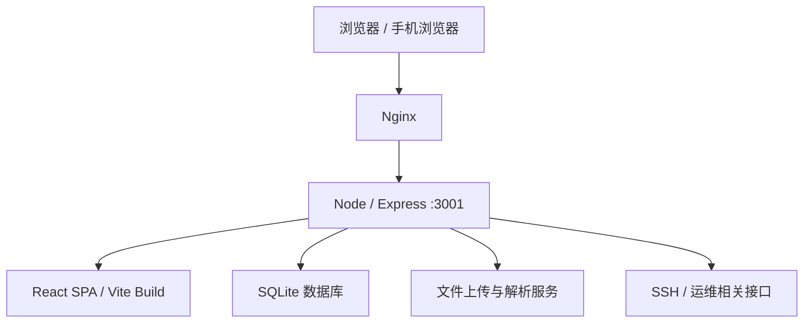

# ym1r

`ym1r` 是一套以“运维中心”为主叙事的个人站点与服务器管理系统。它把**主页展示、个人与项目入口、AI 运维助手、管理后台、服务器信息页**组织成一个完整的产品，而不是单一的聊天页或个人主页。

在线地址：

- [https://ym3861.cn](https://ym3861.cn)
- [https://www.ym3861.cn](https://www.ym3861.cn)

ICP备案：

- [湘ICP备2026017602号](https://beian.miit.gov.cn/)

---

## 1. 项目定位

这个项目的核心不是“展示技术栈”，而是把一个站点真正做成可以上线、可以维护、可以继续扩展的**运维管理中心**。

当前站点的定位分成三层：

1. **首页（/）**
   - 直接进入运维主页
   - 首屏强调服务器管理、权限审计、日志分析、AI 运维助手
   - 把“个人主页 / 项目 / GitHub”降级为次级入口

2. **次级入口（/portal）**
   - 负责承接个人主页、项目页和 GitHub
   - 让主站保持运维导向，避免内容发散

3. **运维能力**
   - 服务器监控与状态展示
   - 管理后台
   - AI 运维助手
   - 文件、权限、日志、服务器详情等模块

你可以把它理解为：

- **主页 = 运维控制台入口**
- **/portal = 个人与项目补充页**
- **/cloudops = AI 运维助手**
- **/admin = 管理后台**

---

## 2. 技术栈

### 前端

- React 18
- TypeScript
- Vite 6
- React Router DOM 6
- Framer Motion
- Tailwind CSS
- Lucide Icons
- Three.js
- React Markdown

### 后端

- Express
- express-session
- better-sqlite3
- bcryptjs
- cors
- multer
- ssh2
- pdf-parse
- mammoth

### 部署

- Nginx 反向代理
- 生产进程由 systemd 管理
- 本地服务端口：`3001`
- 域名：`ym3861.cn` / `www.ym3861.cn`
- 证书：Let’s Encrypt
- Cloudflare real IP 支持

---

## 3. 整体架构



站点的运行逻辑可以概括成：

1. 浏览器访问域名
2. Nginx 转发到本机 `127.0.0.1:3001`
3. Express 提供 API 和静态资源
4. React SPA 负责前端路由
5. SQLite 保存账号、配置、状态等数据

---

## 4. 页面与路由

### 主路由

| 路由 | 页面 | 说明 |
|---|---|---|
| `/` | HomePage | 运维主页，站点主入口 |
| `/portal` | PortalPage | 个人与项目次级入口 |
| `/me` | MePage | 个人主页 |
| `/projects` | ProjectsPage | 项目页 |
| `/cloudops` | CloudOpsPage | AI 运维助手 |
| `/chat` | ChatPage | AI 对话页 |
| `/admin-login` | AdminLoginPage | 管理员登录 |
| `/admin` | AdminPage | 管理后台 |
| `/login` | LoginPage | 普通登录 |
| `/register` | RegisterPage | 注册 |
| `/dashboard` | DashboardPage | 仪表盘 |
| `/servers/:id` | ServerDetailPage | 服务器详情 |

### 兼容路由

- `/ask-me` 会重定向到 `/portal`

### 路由策略

- 站点保留完整 SPA 路由
- 页面切换使用过渡动画
- 大部分入口都通过首页做统一收口

---

## 5. 首页设计说明

首页是整个产品的“运维中心封面页”。它的目标不是展示杂乱内容，而是把你最重要的东西一眼说明白。

### 首页核心信息

- 站点名：`ym1r`
- 主标题：运维管理中心
- 核心说明：服务器管理、权限审计、日志分析、AI 运维助手
- 主操作：运维主页
- 次操作：次级入口

### 首页区块

1. **Hero 首屏**
   - 强调“运维管理中心”
   - 主 CTA 指向运维主页
   - 次 CTA 指向次级入口
   - 移动端做了专门收紧，避免按钮、文字和卡片重叠

2. **Ops First**
   - 展示运维优先的产品思路
   - 包括服务器管理、权限与审计、AI 运维助手三块

3. **Ops Snapshot**
   - 概览当前运维中心的结构和定位
   - 强调 AI 只是辅助，不是主入口

4. **Secondary Entry**
   - 只保留一个明确动作：返回运维主页
   - 个人主页、项目、GitHub 统一收入口径

5. **页脚**
   - 快捷入口
   - GitHub 链接
   - ICP 备案链接

---

## 6. 次级入口页面（/portal）

`/portal` 的作用是“承接主页之外的内容”，但不抢主入口焦点。

### 页面内容

- 个人主页入口
- 项目页入口
- GitHub 入口
- 返回运维主页入口

### 设计原则

- 卡片简洁
- 文案直接
- 只保留和“个人 / 项目 / 代码”相关的内容
- 底部提供一个明确的返回首页动作

---

## 7. AI 运维助手页面

AI 的定位不是闲聊，而是**运维辅助**。

### 适合的能力

- 看日志
- 解释报错
- 整理排查步骤
- 生成安全建议
- 帮你做故障摘要
- 帮你把命令或报错翻译成“人话”

### 不适合的定位

- 不作为首页主入口
- 不抢运维中心焦点
- 不把站点做成纯聊天产品

---

## 8. 管理后台

管理后台用于：

- 用户管理
- 文件管理
- 服务器管理
- 权限与审计
- AI 人设 / 相关配置

### 移动端适配原则

后台页面专门做了移动端收缩与收起逻辑，重点避免：

- 左侧导航压住内容
- 顶部导航和正文重叠
- 卡片高度不一致
- 底层内容被侧栏遮挡

---

## 9. 视觉语言

站点视觉目前是“Apple 风格 + Liquid Glass + 克制的后台感”。

### 视觉关键词

- 玻璃质感
- 大圆角
- 低噪点
- 轻阴影
- 柔和渐变
- 统一按钮高度
- 平衡留白

### 语言目标

- 不做廉价的炫光堆叠
- 不做过重的动效压迫
- 不让页面元素互相覆盖
- 桌面端和手机端保持一致的视觉秩序

---

## 10. 中英文切换

站点支持中英文双语。

### 原则

- 切换后立即全局生效
- 页面语言跟随 `html[lang]`
- 避免同一页中英混杂
- 关键文案都统一管理

### 主要入口

- 顶栏语言切换
- 首页各模块
- 个人页、项目页、运维页、管理页

---

## 11. 深色 / 浅色模式

### 实现方式

- 由 `ThemeContext` 统一管理
- 切换时同步 `data-theme`
- 同时同步 `theme-color`
- 浏览器和页面保持一致

### 动效目标

- 从上到下的线性切换
- 前段快、后段慢
- 不使用过于复杂的全屏跳变

---

## 12. 响应式与移动端策略

这个项目非常重视移动端。

### 移动端重点

- 顶部导航收缩
- 菜单按钮尺寸统一
- 次级菜单可展开但不覆盖正文
- 首页首屏内容压缩
- 个人页 / 项目页 / 管理页避免卡片重叠
- 聊天页底部控件更轻

### 移动端设计目标

- 不重叠
- 不错位
- 不留过大的空白
- 不牺牲主要操作入口

---

## 13. 后端 API 概览

### 健康检查

- `GET /api/health`

### 会话 / 入口状态

- `POST /api/enter`

### 时间

- `GET /api/time`

### 功能路由（按模块划分）

- `/api/auth`
- `/api/chat`
- `/api/admin`
- `/api/files`
- `/api/persona`
- `/api/servers`
- `/api/askMe`
- `/api/cloudops`
- `/api/weather`

### 说明

后端以模块化路由组织，不同功能各自独立，方便后续继续扩展。

---

## 14. 认证与会话

站点使用 `express-session` 做会话管理。

### 关键点

- cookie `httpOnly`
- `sameSite: lax`
- HTTPS 时启用 `secure`
- `APP_ORIGIN` 会影响 cookie 安全策略

### 常见注意事项

- 如果实际访问是 `http://`，但 `APP_ORIGIN` 仍配置成 `https://`，会导致登录态不稳定
- 如果走 Cloudflare / 反代，`trust proxy` 必须正确设置

---

## 15. Nginx 与部署

站点通过 Nginx 反向代理到本地 `3001`。

### Nginx 责任

- 处理 80 / 443
- 反代到 `127.0.0.1:3001`
- 支持 WebSocket
- 支持 Cloudflare real IP
- 托管静态资源与前端 SPA

### 生产建议

- 保留默认站点清理
- 证书和 HTTP->HTTPS 跳转策略要统一
- 反代头部必须保留：
  - `Host`
  - `X-Real-IP`
  - `X-Forwarded-For`
  - `X-Forwarded-Proto`

---

## 16. systemd 服务

生产环境通过 `systemd` 管理。

### 服务特点

- 工作目录固定
- 从 `.env` 读取环境变量
- 崩溃自动重启
- 启动命令为 `npm run start`

### 常用命令

```bash
systemctl status ym1r
systemctl restart ym1r
systemctl stop ym1r
systemctl start ym1r
```

---

## 17. 开发与构建

### 本地开发

```bash
npm install
npm run dev
```

### 生产构建

```bash
npm run build
```

### 生产启动

```bash
npm run start
```

---

## 18. 目录结构说明

### 前端

- `src/App.tsx`：路由入口
- `src/main.tsx`：React 挂载入口
- `src/pages/`：页面级组件
- `src/components/`：通用组件
- `src/context/`：主题与语言上下文
- `src/effects/`：页面切换与过渡
- `src/lib/`：工具函数
- `src/index.css`：全局样式与视觉系统

### 后端

- `server.js`：Express 启动入口
- `server/db.js`：数据库封装
- `server/routes/`：业务路由
- `server/services/`：解析、天气等服务

### 部署

- `deploy/nginx/ym1r.conf.example`
- `deploy/systemd/ym1r.service.example`

---

## 19. 当前仓库里最重要的页面

### 首页

- `/`
- 运维中心主入口

### 次级入口

- `/portal`
- 个人主页 / 项目 / GitHub 的补充入口

### 服务器运维

- `/cloudops`
- `/dashboard`
- `/servers/:id`

### 管理类

- `/admin`
- `/admin-login`

### 个人与内容

- `/me`
- `/projects`
- `/chat`

---

## 20. 常见问题

### 1）为什么手机上有时会显示不安全？

通常是 HTTPS / 反代 / 浏览器缓存 / HSTS 组合导致。  
如果域名切换过 HTTP 与 HTTPS，要确保：

- `APP_ORIGIN`
- 浏览器缓存
- Cloudflare SSL 模式
- Nginx 证书

四者一致。

### 2）为什么登录后会跳回登录页？

最常见原因是：

- cookie 的 secure 策略和实际访问协议不一致
- session 没有正确写回
- 访问域名和后端 origin 不一致

### 3）为什么手机端会卡？

通常来自：

- 大量玻璃/模糊效果
- 首屏动效过重
- bundle 体积偏大
- 同屏元素过多

### 4）为什么页面里会出现问号？

过去曾出现过编码问题。  
现在仓库里的中文文案已经重新清理过，但如果你看到旧内容，优先：

- 强刷页面
- 清浏览器缓存
- 确认线上是否已同步到最新提交

---

## 21. 备份与恢复

### 生产备份建议

- 保留 `server.js`
- 保留 `server/`
- 保留 `src/`
- 保留 `.env`
- 保留 `dist/`
- 保留数据库文件

### 恢复顺序

1. 拉取源码
2. 安装依赖
3. 配置 `.env`
4. `npm run build`
5. `npm run start`
6. 使用 systemd 接管
7. Nginx 反代到 `3001`

---

## 22. 你现在看到的成品是什么

现在这份站点已经不是一个“半成品页面”，而是一个结构完整的：

- 运维主页
- 个人与项目补充入口
- AI 运维助手
- 管理后台
- 服务器详情
- 可部署生产服务
- 可回收的 GitHub 仓库

它可以继续改，但当前已经具备：

- 上线
- 反代
- HTTPS
- 手机端适配
- 中英文切换
- 统一视觉语言
- 运维管理中心定位

---

## 23. 运行清单（最简版）

```bash
npm install
npm run build
npm run start
```

生产环境建议由 `systemd` 托管，并由 Nginx 统一入口。

---

## 24. 备注

如果你后续要继续迭代，建议按这个顺序：

1. 先继续减小移动端首屏与入口页的体积
2. 再把 `CloudOps` 页面进一步做成真正的运维助手
3. 最后把 `Admin` 的信息密度与审计能力再补强

